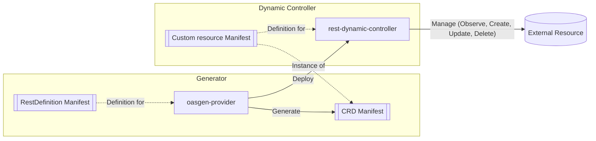
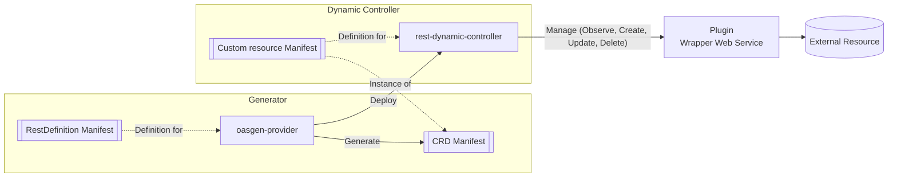

# Krateo OASGen Provider

The Krateo OASGen Provider is a Kubernetes controller that generates Custom Resource Definitions (CRDs) and controllers to manage resources directly from OpenAPI Specification (OAS) 3.0/3.1 documents.
It enables seamless integration of API-defined resources into Kubernetes environments.

## Summary

- [Glossary](#glossary)
- [Architecture](#architecture)
- [Workflow](#workflow)
- [Requirements](#requirements)
- [RestDefinition Specifications](#restdefinition-specifications)
  - [CRD Specification](#crd-specification)
  - [API Endpoints Requirements](#api-endpoints-requirements)
  - [About RestDefinition Actions](#about-restdefinition-actions)
- [How to Install](#how-to-install)
- [Examples and Troubleshooting](#examples-and-troubleshooting)
- [Environment Variables and Flags](#environment-variables-and-flags)
- [Security Features](#security-features)
- [Best Practices](#best-practices)

## Glossary

- **CRD (Custom Resource Definition):** A Kubernetes resource that defines custom objects and their schemas.
- **RestDefinition:** A Custom Resource managed by oasgen-provider that defines how API resources are managed in Kubernetes based on OAS specifications.
- **RDC (Rest Dynamic Controller):** A controller deployed by the oasgen-provider to manage Custom Resources defined by a RestDefinition.
- **OAS (OpenAPI Specification):** A standard, language-agnostic interface description for REST APIs (https://www.openapis.org/).
- **Plugin:** An **optional** wrapper web service to implement to maintain consistent API interfaces when needed. Can be also viewed as an **adapter pattern** / proxy service since it add a layer of indirection between the Rest Dynamic Controller and the external API.

## Architecture

In the following diagrams, we illustrate the architecture and workflow of the OASGen Provider in two scenarios: a standard scenario and a scenario that includes an optional Plugin (Wrapper Web Service).

### Standard scenario


<br/>
The diagram illustrates how the OASGen Provider processes OpenAPI Specifications to generate CRDs and deploy the Rest Dynamic Controller (RDC). The RDC manages custom resources and interacts with external APIs, optionally through wrapper web services when needed.

### Scenario with Plugin (Wrapper Web Service)



<br/>
In this scenario, the Rest Dynamic Controller interacts with an optional Plugin (Wrapper Web Service) to handle API calls. This is useful when the external API does not conform to the expected interface or requires additional processing.

## Workflow

### Standard scenario

1. User applies a RestDefinition CR.
2. oasegn-provider fetches the OAS specification.
3. oasegn-provider generates a CRD based on the OAS schema.
4. oasegn-provider deploys the specific Rest Dynamic Controller.
5. Rest Dynamic Controller manages custom resources according to API specifications.
6. Resources states are synchronized with external APIs (observe, create, update, delete).

### Scenario with Plugin (Wrapper Web Service)

1. User applies a RestDefinition CR.
2. oasegn-provider fetches the OAS specification.
3. oasegn-provider generates a CRD based on the OAS schema.
4. oasegn-provider deploys the specific Rest Dynamic Controller.
5. Rest Dynamic Controller manages custom resources according to API specifications.
6. Resources states are synchronized with external APIs (observe, create, update, delete) **through the Plugin (Wrapper Web Service) as an intermediary**.

## Requirements

- Kubernetes cluster (v1.20+ recommended).
- OpenAPI Specification 3.0+ documents for your APIs.
- Network access to API endpoints from the cluster.

## RestDefinition Specifications

### CRD Specification

The RestDefinition CRD specification can be found here: [RestDefinition CRD](crds/ogen.krateo.io_restdefinitions.yaml).

### API Endpoints Requirements

1. Field names must be consistent across all actions (`create`, `update`, `findby`, `get`, `delete`)
2. API responses must contain all fields defined in the CRD
3. Path parameters and request / response body fields should use consistent naming (e.g., `userId` vs `user_id` is not consistent, also having `repositoryId` as path paramter and `id` in the response body is not consistent)

### About Resource reconciliation and RestDefinition Actions

Krateo controllers (among which `rest-dynamic-controller`) support 4 verbs to provide resource reconciliation:

- **Observe**: This verb observes the resource state in the external system. It fetches the current state of the resource. If the resource does not exist or differs from the desired state, the controller will create or update it accordingly.
- **Create**: This verb creates a new resource in the external system.
- **Update**: This verb updates an existing resource in the external system.
- **Delete**: This verb deletes a resource from the external system.

oasgen-provider supports 5 **actions**: `findby`, `get`, `create`, `update`, and `delete`.
These actions are used by the Rest Dynamic Controller to actually implement the above verbs for the resource reconciliation process.

```mermaid

TODO
```

#### `findby` action

The `findby` action finds a resource using its **identifiers**, which are defined as a list of fields in the RestDefinition manifest.
The API endpoint used for this action must return a **list or collection of resources**, from which the `rest-dynamic-controller` will select the matching resource.

##### Purpose of Identifiers

Identifiers are fields that uniquely identify a resource within the external system.
Unlike technical keys such as `id` or `uuid`, in the context of `findby`, these identifiers are human-friendly and typically **available before a resource is created**:
- Examples: `name`, `email`, `title`
- Characteristics: unique per resource, usually string-based, user-facing

Note that it is the responsibility of the user to ensure that the identifiers defined in the RestDefinition manifest are indeed unique within the external system.
For instance, if `name` is used as an identifier, the user must ensure that no two resources can have the same `name` in the external system in the context of the resource being managed. 

As an example, in the context of a Email service, `email` is a good candidate for an identifier because it is unique per user. Even if the external system uses a unique technical identifier (like `id` or `uuid`) as the primary key for users, `email` can still be used as an identifier for the `findby` action because it is unique per user and available before the user is created.

##### Why Use `findby`?

The `findby` action is commonly used by the Observe verb during the first step of the reconciliation process.

When a resource manifest is applied to the Kubernetes cluster for the first time, the `rest-dynamic-controller` must check whether the resource already exists in the external system. At this stage:

- The resource’s external identifier (id, uuid, etc.) is **not yet available in the resource manifest**.
- These identifiers are typically generated by the external system upon creation.

Because of this, usually the `rest-dynamic-controller` cannot use the `get` action, which typically requires a unique technical identifier (id, uuid, etc.) to fetch a single resource.
The HTTP GET endpoint for the `get` action would look like this:
```sh
GET /resources/{id}
```
Where `{id}` is a unique technical identifier that is not known before the resource is created but it is generated by the external system.
In these cases, `rest-dynamic-controller` should rely on `findby` to search for the resource using the human-friendly identifiers that are available upfront.

##### When the `findby` action is not needed

The `findby` action is not needed when the external system uses a human-friendly unique identifier (like `name` or `email`) as the primary key for resources, and this identifier is available before the resource is created.
Therefore, the HTTP GET endpoint would look like this:
```sh
GET /resources/{name}
```
In such cases, the `get` action can be used directly to fetch the resource from the external system even during the first ever reconciliation step.

##### Why not only set `findby` and not `get`?

In theory, `rest-dynamic-controller` could work with just the `findby` action and without the `get` action, however there is the major drawback that the `findby` action returns a **list or collection of resources**.
This lists can be very large, and **fetching and processing them can be inefficient and slow**.
For this reason, it is strongly recommended to always define both `findby` and `get` actions in the RestDefinition manifest, whenever possible and meaningful.

#### Get

This action retrieves the current state of a resource which typically means fetching a single resource by a unique identifier.
Differently from `findby`, the API endpoint used for this action must return a **single resource**.

As mentioned in the `findby` section, the nature of the identifiers vary depending on the external system.

| Technical Identifier (typically `get`) | Human-friendly Identifier (typically `findby`) |
|----------------------------|-------------------------------------|
| id                         | name                                |
| uuid                       | email                               |
| resourceId                 | title                               |

In the majority of cases, the `get` and the `findby` actions use different identifiers:
- `findby` uses human-friendly identifiers that are typically available before the resource is created (e.g., `name`, `email`, `title`).
- `get` uses unique technical identifiers that are typically generated by the external system upon resource creation (e.g., `id`, `uuid`, `resourceId`).

Therefore the `get` action is typically used by the Observe verb during subsequent reconciliation loops (after the first one onward), after the resource has been created and the unique technical identifier (id, uuid, etc.) is known and stored in the resource status.

##### When the `get` action is sufficient

There are cases however where only the `get` action is sufficient for the Observe verb, for example when the external system uses a human-friendly unique identifier like `name` or `email` as the primary key for resources, and this identifier is available before the resource is created.
Therefore, the HTTP GET endpoint would look like this:
```sh
GET /resources/{name}
```
In such cases, the `get` action can be used directly to fetch the resource from the external system even during the first ever reconciliation step.

An example of this is the GitHub API, in the context of [repositories](https://github.com/krateoplatformops/github-provider-kog-chart/blob/main/chart/templates/rd-repo.yaml#L22-L24), the `name` is unique per user/organization and it is available before the repository is created, therefore the `get` action can be used directly to fetch a repository by its `name`. For example:
```sh
GET /repos/{owner}/{repo}
```
Where `{repo}` is the repository name, which is unique per user/organization and it is available before the repository is created (it is provided by the user when creating the repository).

##### Typical complete workflow with both findby and get

Assumptions:
- The external system uses a unique technical identifier (id, uuid, etc.) as the primary key for resources.
- The unique technical identifier (id, uuid, etc.) is generated by the external system upon resource creation.
- The unique technical identifier (id, uuid, etc.) is therefore not known before the resource is created.
- The RestDefinition manifest defines both `findby` and `get` actions.
- The HTTP GET endpoint assigned to the `get` action looks like this:
```sh
GET /resources/{id}
```
Where `{id}` is a unique technical identifier that is not known before the resource is created but it is generated by the external system.
- The HTTP GET endpoint assigned to the `findby` action looks like this:
```sh
GET /resources
```

Having defined the above assumptions, here is a typical complete workflow, assuming resource does not exist yet in the external system, would be:

1. The user applies a resource manifest to the Kubernetes cluster.
2. The `rest-dynamic-controller` uses the `findby` action to search for the resource using the human-friendly identifiers.
3. If the resource is not found, the `rest-dynamic-controller` uses the `create` action to create the resource in the external system.
4. The `status` of the resource is populated with the unique technical identifier (id, uuid, etc.) returned by the `create` action.
5. In subsequent reconciliation loops, the `rest-dynamic-controller` uses the `get` action with the unique technical identifier to fetch the resource.


#### `create`

  - `rest-dynamic-controller` supports resource creation using the `create` action. The endpoint used for this action must accept a request body containing the resource data in the format defined by the OAS schema. The request body should be strongly typed to match the OAS schema, ensuring data validation before being sent to the external system. The request body is used by `oasgen-provider` to generate the CRD.
  - this action could return a `202 Accepted` response, indicating that the resource creation is in progress. In this case, the `rest-dynamic-controller` will put the Custom Resource (CR) into a `Pending` state, and the controller will continue to monitor the resource until it is fully created (the `get` or `findby` does not return `404`). Once the resource is created, the controller will update the CR status to `Ready`.

  - `rest-dynamic-controller` supports resource updates using the `update` action. The endpoint used for this action must use the same request body as the `create` action (it can have fewer fields, but not more, because the CRD is generated from the `create` request body).

  - `rest-dynamic-controller` supports resource deletion using the `delete` action. This endpoint should delete the resource from the external system. This means that `rest-dynamic-controller` expects a subsequent call to the `findby` or `get` action will not return the deleted resource. The endpoint should not return an error if the resource does not exist, as it is expected that the resource has already been deleted.
  
Any API behavior that does not match these requirements will require a web service wrapper to normalize the API interface. This is common with APIs that do not follow consistent naming conventions or have different response structures.
To learn more about web service wrappers, please refer to the [cheatsheet](docs/cheatsheet.md#extended-example-external-api-that-requires-a-webservice-to-handle-external-api-calls).

### Type-Safe Status Fields

The OASGen Provider automatically generates a `status` subresource for your CRD, providing visibility into the state of the external resource. 
The fields within the status are derived from two sources in your `RestDefinition`:

- `identifiers`: Fields used to uniquely identify the resource.
- `additionalStatusFields`: Any other fields you wish to expose in the status.

To ensure type safety, the provider inspects the response schema of the `get` (or `findby` as a fallback) action in your OpenAPI specification. It uses the types defined in the OAS to generate the corresponding fields in the CRD's status schema.

#### String Fallback Mechanism in Status Fields

When the provider cannot find a specified `identifier` or `additionalStatusField` in the OpenAPI response schema, it employs a **string fallback** mechanism for that status fields:
1.  The provider logs a warning indicating that the field was not found in the OAS response.
2.  It generates the status field with `type: string` as a safe default.

#### Kubernetes API Server Validation example

If the response schema of an hypothetical `update` action returns as a response body a field with a type different than the one defined in the CRD, the Kubernetes API server will reject the update request:
- The controller receives the response body from the external API. 
- The controller sends the update request for the custom resource's status to the Kubernetes API server. 
- The API server receives the request and validates it against the CRD's schema.
- It sees that the update is trying to put a string ("123") into the `status.revision` field.
- It checks the schema and sees that `status.revision` must be an integer.
- The validation fails, and the Kubernetes API server rejects the entire status update.

If you check the status of the custom resource, you will see that the `status.conditions` field contains an error message indicating that the update failed due to a schema validation error, like the following:
```yaml
status:
  conditions:
  - lastTransitionTime: "2025-07-22T12:45:38Z"
    message: ""
    reason: Creating
    status: "False"
    type: Ready
  - lastTransitionTime: "2025-07-22T12:53:43Z"
    message: 'observe failed: Pipeline.azuredevops.kog.krateo.io "test-pipeline-kog-1"
      is invalid: [status.id: Invalid value: "string": id in body must be of type
      integer: "string", status.revision: Invalid value: "string": revision in body
      must be of type integer: "string"]'
    reason: ReconcileError
    status: "False"
    type: Synced
```

## How to Install

1. Install OASGen Provider:
```sh
helm repo add krateo https://charts.krateo.io
helm repo update
helm install krateo-oasgen-provider krateo/oasgen-provider --namespace krateo-system
```

## Examples and Troubleshooting

You can see a more practical guide on `oasgen-provider` usage at [this link](cheatsheet.md).

## Environment Variables and Flags

| Name                                   | Description                | Default Value | Notes         |
|:---------------------------------------|:---------------------------|:--------------|:--------------|
| `OASGEN_PROVIDER_DEBUG`                 | Enables debug logging      | `false`       | Use `--debug` flag |
| `OASGEN_PROVIDER_SYNC`                  | Sync period for controller manager | `1h`          | Duration |
| `OASGEN_PROVIDER_POLL_INTERVAL`         | Poll interval for resource drift checks | `5m`          | Duration |
| `OASGEN_PROVIDER_MAX_RECONCILE_RATE`    | The number of concurrent reconciles for each controller. This is the maximum number of resources that can be reconciled at the same time. | `3`           | Integer |
| `OASGEN_PROVIDER_LEADER_ELECTION`       | Enables leader election for controller manager | `false`      | Use `--leader-election` flag |
| `OASGEN_PROVIDER_MAX_ERROR_RETRY_INTERVAL` | Maximum retry interval on errors | `1m`          | Duration |
| `OASGEN_PROVIDER_MIN_ERROR_RETRY_INTERVAL` | Minimum retry interval on errors | `1s`          | Duration |

## Security Features

- Automatic generation of RBAC policies for custom resources
- Secure credential management through Kubernetes secrets
- Field validation based on OAS schemas
- Optional web service wrappers for additional security layers

## Best Practices

1. Always use OAS 3.0+ specifications
2. Maintain consistent field naming across API endpoints
3. Use web service wrappers when API interfaces are inconsistent
4. Regularly update OAS documents to match API changes
5. Monitor controller logs with `krateo.io/connector-verbose: "true"`

## Unsupported features

- `nullable` is not supported by OASGen provider. `nullable` was removed in OAS 3.1 in favor of using `null` type in the array `type`. Instead, `null` type in the array `type` is supported by OASGen provider.

- `anyOf` and `oneOf` are not supported by OASGen provider.

- `format` is not supported by OASGen provider.

### OAS 3.0 vs OAS 3.1

For a reference to the differences between OAS 3.0 and OAS 3.1, please check the official documentation: https://www.openapis.org/blog/2021/02/16/migrating-from-openapi-3-0-to-3-1-0
