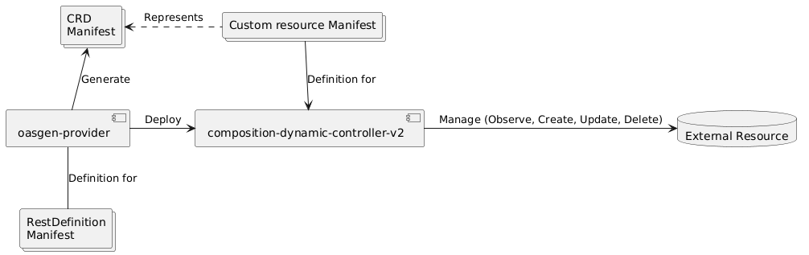

# oasgen-provider
A k8s controller that generates CRDs and controller to manage resources from OpenAPI Specification (OAS) 3.1 (also 3.0 is supported).

## Summary

- [oasgen-provider](#oasgen-provider)
  - [Summary](#summary)
  - [Core Features](#core-features)
  - [Benefits](#benefits)
  - [Technical Overview](#technical-overview)
    - [Architecture](#architecture)
  - [Getting Started](#getting-started)
  - [Note on API Authentication](#note-on-api-authentication)
  - [How to convert OAS 2.0 to OAS 3.0](#how-to-convert-oas-20-to-oas-30)

## Core Features
- **CRD Generation**: Automatically generates CRDs from OAS 3.1 definitions. This allows users to define custom resources that match the schema described in their API specifications, enabling seamless integration and management within Kubernetes environments.
- **Controller Generation**: Beyond CRDs, oasgen-provider also automates the creation of controllers. Controllers are essential components in Kubernetes that watch for changes in resource states and act accordingly to maintain desired states. By generating controllers from OAS definitions, oasgen-provider facilitates the management of custom resources according to the logic defined in the API specifications.
- **Custom Resource Management**: With the generated CRDs and controllers, users can manage custom resources directly within Kubernetes. This includes creating, updating, deleting, and monitoring the state of these resources, all aligned with the definitions provided in the OAS 3.1 specification.


## Benefits
- **Streamlined Development:** Reduces manual coding efforts, streamlining the development process for Kubernetes-native applications.
- **Enhanced Flexibility:** Enables easy adaptation of Kubernetes resources to match evolving API specifications.
- **Improved Integration:** Facilitates better integration between Kubernetes and external services or applications.

## Technical Overview

`oasgen-provider` analyzes OAS 3.1 definitions to discern the structure and requirements of the intended resources. Utilizing this information, it orchestrates the deployment of the [composition-dynamic-controller-v2](https://github.com/krateoplatformops/composition-dynamic-controller-v2), specifically tasked with managing resources that correspond to the type defined by the CRD.

### Architecture


## API Endpoints Requirements

1. Field Naming Consistency:
   - Field names must be consistent across all actions (`create`, `update`, `findby`, `get`, `delete`).

2. Response Consistency with Custom Resource Definition (CRD):
   - The responses of the endpoints must be consistent with the fields in the Custom Resource Definition (CRD).
   - Specifically, the responses of the GET (`get` action) and LIST (`findby` action) APIs should contain at least all the fields present in the CRD specification (authentication references should not be excluded from these responses). 

## Getting Started

1. **Prepare OAS Definition:** Begin by creating or obtaining an OAS 3.0+ specification that outlines the API and resources you intend to manage within Kubernetes. For the purpose of this guide, our objective is to generate a controller and the Custom Resource Definition (CRD) needed to manage (observe, create, update, delete) a resource of type GitRepository on Azure DevOps. The initial step involves locating the OAS Specification file that describes the APIs for GitRepository resources. You can find the Git repository OAS 2 Specification [here](https://github.com/MicrosoftDocs/vsts-rest-api-specs/blob/master/specification/git/7.0/git.json). Please note that in this scenario, the specification is in version 2, whereas oasgen-provider necessitates OAS at version 3.0+. Refer to [the instructions](#how-to-converto-oas2-to-oas3) on how to convert OAS 2 to OAS 3.0+. For your convenience, you can view the converted and corrected OAS 3.0+ specification for GitRepository at [this](https://github.com/krateoplatformops/azuredevops-oas3/blob/main/git/git-new.yaml) link.

- Preparing the OpenAPI Specification file also requires maintaining consistency in parameter naming. For example, consider the Endpoint resource of Azure DevOps (specification available [here](https://raw.githubusercontent.com/krateoplatformops/azuredevops-oas3/main/serviceEndpoint/endpoints.yaml)):

  1. The GET API endpoint `/{organization}/{project}/_apis/serviceendpoint/endpoints/{endpointId}` uses a path parameter `endpointId`.
  2. The POST API endpoint `/{organization}/_apis/serviceendpoint/endpoints` uses a body field `id`.

    To address this inconsistency, you have two options:

     - Change the name of the path parameter from `endpointId` to `id` in the GET endpoint to match the POST endpoint.
     - Create a wrapper web service that maintains the original mapping and update the OpenAPI Specification adding the webservice API endpoints you intend to use.\
       - Further information on creating a wrapper web service for the API [below].(#how-to-write-a-webservice)
   
1. **Run oasgen-provider:** Execute the `oasgen-provider`. You could install the provider on your cluster using Helm

    ```bash
    $ helm repo add krateo https://charts.krateo.io
    $ helm repo update krateo
    $ helm install oasgen-provider krateo/oasgen-provider
    ```
   
2. **Compile a RestDefinition Manifest**: RestDefinition is the Kind of the resource that the oasgen-provider can manage. Here is an example of a RestDefinition Manifest that when applied into the cluster create a GitRepository CRD with the fields from the OpenApi specification provided and deploys a controller that is ready to manage resources of type GitRepository.

    ```yaml
    kind: RestDefinition
    apiVersion: swaggergen.krateo.io/v1alpha1
    metadata:
        name: repository-def
        namespace: default
    spec:
        # URL pointing to the OpenAPI specification document
        oasPath: https://github.com/krateoplatformops/azuredevops-oas3/blob/main/git/git-new.yaml
        # Grouping identifier for the resources managed by this definition
        resourceGroup: azure.devops.com
        # Details about the resource being managed
        resource: 
            # Kind of the resource, in this case, GitRepository
            kind: GitRepository
            # Identifiers for the resource, which could be used for unique identification
            identifiers: 
            - id
            - name
            # Description of actions supported by the resource along with HTTP methods and paths
            verbsDescription:
            - action: create
            # HTTP method for the create action
            method: POST
            # Path template for the create action
            path:  /{organization}/{project}/_apis/git/repositories
            - action: get
            method: GET
            path:  /{organization}/{project}/_apis/git/repositories/{repositoryId}
            - action: findby
            method: GET
            path:  /{organization}/{project}/_apis/git/repositories
            - action: delete
            method: DELETE
            path:  /{organization}/{project}/_apis/git/repositories/{repositoryId}
    ```

3. **You are ready to go!** At this point you have a running controller that is able to manage resources of type 'GitRepository'. You can get Kind and APIVersion of installed crds in the status of the RestDefinition CR. 

    Sample:
    ```yaml 
    status:
        authentications:
        - apiVersion: azure.devops.com/v1alpha1
        kind: BasicAuth
        oasPath: https://github.com/krateoplatformops/azuredevops-oas3/blob/main/git/git-new.yaml
        resource:
        apiVersion: azure.devops.com/v1alpha1
        kind: GitRepository
    ```

## Note on API Authentication

If the provided OAS specification mentions authentication methods, `oasgen-provider` will generate the corresponding authentication CRDs. Additionally, it adds an `authenticationRefs` field to the specs of the resource CRD to reference the CR of the authentication.

## How to convert OAS 2.0 to OAS 3.0

1. **Import the OAS2 File**: Visit the website [Swagger Editor](https://editor.swagger.io). You can either import your OAS 2.0 file directly or copy and paste its contents into the editor. The editor will automatically recognize and display the JSON in YAML format if necessary.

2. **Convert to OpenAPI 3**: Once your OAS 2.0 document is loaded in the Swagger Editor, navigate to `Edit` -> `Convert to OpenAPI 3`. Then, click on "Convert". This action will upgrade your document to OpenAPI version 3.0.

3. **Review and Edit in a YAML Editor**: After conversion, it's advisable to review the document for any errors or warnings that may have arisen during the conversion process. Copy the content and paste it into a dedicated YAML editor for easier manipulation. If you're using Visual Studio Code, installing an extension specifically designed for OpenAPI Specifications can enhance readability and validation.

4. **Resolve Conversion Errors Manually**: Be aware that the automatic conversion might not perfectly translate all aspects of your original OAS 2 document into OAS 3.0 syntax. Some manual adjustments may be required to fully align with OpenAPI 3 specifications. Carefully review the converted document, paying attention to any highlighted errors or warnings, and make the necessary corrections.

By following these steps, you should be able to successfully convert an OAS2 document to OAS3 while ensuring the integrity and accuracy of the specification.

## How to write a WebService
### Webservice Requirements
Needs to be documented with OpenAPI Specification (the requirements of this OpenAPI specification are the same reported in ["API Endpoints Requirements" section](#api-endpoints-requirements))

### Implementation
Here are some sample implementation written in different programming languages

- **Java - (Springboot):** [azuredevops-oas3-plugin](https://github.com/krateoplatformops/azuredevops-oas3-plugin) and the relative section in [PipelinePermission OAS](https://github.com/krateoplatformops/azuredevops-oas3/blob/1b04b8d6c289f416d1b7a003fbb2337bd7138658/approvalandchecks/pipelinepermissions.yaml#L23). 
- **Python - (Flask)** [github-oas3-plugin](https://github.com/krateoplatformops/github-oas3-plugin) and the relative section in [Github OAS](https://github.com/krateoplatformops/github-oas3/blob/c25b1c98e9b13efa4a7d1a9b387facc5df963bf8/openapi-webservice.yaml) (search for `/repository/{owner}/{repo}/collaborators/{username}/permission`)

### Deployment
