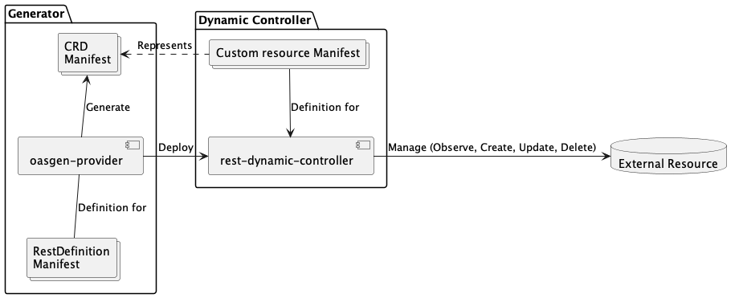

# Krateo OASGen Provider

The Krateo OASGen Provider is a Kubernetes controller that generates Custom Resource Definitions (CRDs) and controllers to manage resources directly from OpenAPI Specification (OAS) 3.1 documents (with support for OAS 3.0). It enables seamless integration of API-defined resources into Kubernetes environments.

## Summary

- [Krateo OASGen Provider](#krateo-oasgen-provider)
  - [Summary](#summary)
  - [Glossary](#glossary)
  - [Architecture](#architecture)
  - [Workflow](#workflow)
  - [Requirements](#requirements)
  - [RestDefinition Specifications](#restdefinition-specifications)
    - [CRD Specification](#crd-specification)
    - [API Endpoints Requirements](#api-endpoints-requirements)
    - [About RestDefinition Actions](#about-restdefinition-actions)
  - [How to Install](#how-to-install)
  - [Examples and Troubleshooting](#examples-and-troubleshooting)
  - [Environment Variables and Flags](#environment-variables-and-flags)
  - [Security Features](#security-features)
  - [Best Practices](#best-practices)

## Glossary

- **CRD (Custom Resource Definition):** A Kubernetes resource that defines custom objects and their schemas.
- **RestDefinition:** A custom resource that defines how API resources are managed in Kubernetes based on OAS specifications.
- **RDC (Rest Dynamic Controller):** A controller deployed by the provider to manage resources defined by a RestDefinition.
- **OAS (OpenAPI Specification):** A standard, language-agnostic interface description for REST APIs.
- **Plugin:** A wrapper service that maintains consistent API interfaces when needed. 

## Architecture



The diagram illustrates how the OASGen Provider processes OpenAPI Specifications to generate CRDs and deploy the Rest Dynamic Controller (RDC). The RDC manages custom resources and interacts with external APIs, optionally through wrapper web services when needed.

## Workflow

1. User applies a RestDefinition CR
2. Provider fetches the OAS specification
3. Provider generates CRD based on the OAS schema
4. Provider deploys the Rest Dynamic Controller
5. Controller manages custom resources according to API specifications
6. Resources are synchronized with external APIs

## Requirements

- Kubernetes cluster (v1.20+ recommended)
- OpenAPI Specification 3.0+ documents for your APIs
- Network access to API endpoints from the cluster

## RestDefinition Specifications

### CRD Specification

To view the CRD configuration, visit [this link](https://doc.crds.dev/github.com/krateoplatformops/oasgen-provider).


### API Endpoints Requirements

1. Field names must be consistent across all actions (`create`, `update`, `findby`, `get`, `delete`)
2. API responses must contain all fields defined in the CRD
3. Path parameters and body fields should use consistent naming


### About RestDefinition Actions

Krateo controllers support 4 verbs to provide resource reconciliation:

- **Observe**: This verb observes the resource state in the external system. It fetches the current state of the resource. If the resource does not exist or differs from the desired state, the controller will create or update it accordingly.
  - `rest-dynamic-controller` supports searching for external resources using two actions (it is advised to specify both actions in the RestDefinition if possible, although it is not mandatory):
  - **findby**: This action finds a resource by its identifiers. The endpoint used for this action must return a list of resources that match the identifiers. This is useful when you want to find a resource based on specific criteria, such as a unique identifier or a combination of fields.
  - **get**: This action retrieves the current state of a resource. This typically fetches a single resource by its unique identifier.
- **Create**: This verb creates a new resource in the external system.
  - `rest-dynamic-controller` supports resource creation using the `create` action. The endpoint used for this action must accept a request body containing the resource data in the format defined by the OAS schema. The request body should be strongly typed to match the OAS schema, ensuring data validation before being sent to the external system. The request body is used by `oasgen-provider` to generate the CRD.
  - this action could return a `202 Accepted` response, indicating that the resource creation is in progress. In this case, the `rest-dynamic-controller` will put the Custom Resource (CR) into a `Pending` state, and the controller will continue to monitor the resource until it is fully created (the `get` or `findby` does not return `404`). Once the resource is created, the controller will update the CR status to `Ready`.
- **Update**: This verb updates an existing resource in the external system.
  - `rest-dynamic-controller` supports resource updates using the `update` action. The endpoint used for this action must use the same request body as the `create` action (it can have fewer fields, but not more, because the CRD is generated from the `create` request body).
- **Delete**: This verb deletes a resource from the external system.
  - `rest-dynamic-controller` supports resource deletion using the `delete` action. This endpoint should delete the resource from the external system. This means that `rest-dynamic-controller` expects a subsequent call to the `findby` or `get` action will not return the deleted resource. The endpoint should not return an error if the resource does not exist, as it is expected that the resource has already been deleted.
  
Any API behavior that does not match these requirements will require a web service wrapper to normalize the API interface. This is common with APIs that do not follow consistent naming conventions or have different response structures.
To learn more about web service wrappers, please refer to the [cheatsheet](docs/cheatsheet.md#extended-example-external-api-that-requires-a-webservice-to-handle-external-api-calls).

### Type-Safe Status Fields

The OASGen Provider automatically generates a `status` subresource for your CRD, providing visibility into the state of the external resource. The fields within the status are derived from two sources in your `RestDefinition`:

- `identifiers`: Fields used to uniquely identify the resource.
- `additionalStatusFields`: Any other fields you wish to expose in the status.

To ensure type safety, the provider inspects the response schema of the `get` (or `findby` as a fallback) action in your OpenAPI specification. It uses the types defined in the OAS to generate the corresponding fields in the CRD's status schema.

#### String Fallback Mechanism

When the provider cannot find a specified `identifier` or `additionalStatusField` in the OpenAPI response schema, it employs a **string fallback** mechanism:
1.  The provider logs a warning indicating that the field was not found in the OAS response.
2.  It generates the status field with `type: string` as a safe default.

#### Kubernetes API Server Validation example

If the response schema of an hypothetical `update` action returns as a response body a field with a type different than the one defined in the CRD, the Kubernetes API server will reject the update request:
- The controller receives the response body from the external API. 
- The controller sends the update request for the custom resource's status to the Kubernetes API server. 
- The API server receives the request and validates it against the CRD's schema.
- It sees that the update is trying to put a string ("123") into the `status.revision` field.
- It checks the schema and sees that `status.revision` must be an integer.
- The validation fails, and the Kubernetes API server rejects the entire status update.

If you check the status of the custom resource, you will see that the `status.conditions` field contains an error message indicating that the update failed due to a schema validation error, like the following:
```yaml
status:
  conditions:
  - lastTransitionTime: "2025-07-22T12:45:38Z"
    message: ""
    reason: Creating
    status: "False"
    type: Ready
  - lastTransitionTime: "2025-07-22T12:53:43Z"
    message: 'observe failed: Pipeline.azuredevops.kog.krateo.io "test-pipeline-kog-1"
      is invalid: [status.id: Invalid value: "string": id in body must be of type
      integer: "string", status.revision: Invalid value: "string": revision in body
      must be of type integer: "string"]'
    reason: ReconcileError
    status: "False"
    type: Synced
```

## How to Install

1. Install OASGen Provider:
```sh
helm repo add krateo https://charts.krateo.io
helm repo update
helm install krateo-oasgen-provider krateo/oasgen-provider --namespace krateo-system
```

## Examples and Troubleshooting

You can see a more practical guide on `oasgen-provider` usage at [this link](cheatsheet.md).

## Environment Variables and Flags

| Name                                   | Description                | Default Value | Notes         |
|:---------------------------------------|:---------------------------|:--------------|:--------------|
| `OASGEN_PROVIDER_DEBUG`                 | Enables debug logging      | `false`       | Use `--debug` flag |
| `OASGEN_PROVIDER_SYNC`                  | Sync period for controller manager | `1h`          | Duration |
| `OASGEN_PROVIDER_POLL_INTERVAL`         | Poll interval for resource drift checks | `5m`          | Duration |
| `OASGEN_PROVIDER_MAX_RECONCILE_RATE`    | The number of concurrent reconciles for each controller. This is the maximum number of resources that can be reconciled at the same time. | `3`           | Integer |
| `OASGEN_PROVIDER_LEADER_ELECTION`       | Enables leader election for controller manager | `false`      | Use `--leader-election` flag |
| `OASGEN_PROVIDER_MAX_ERROR_RETRY_INTERVAL` | Maximum retry interval on errors | `1m`          | Duration |
| `OASGEN_PROVIDER_MIN_ERROR_RETRY_INTERVAL` | Minimum retry interval on errors | `1s`          | Duration |

## Security Features

- Automatic generation of RBAC policies for custom resources
- Secure credential management through Kubernetes secrets
- Field validation based on OAS schemas
- Optional web service wrappers for additional security layers

## Best Practices

1. Always use OAS 3.0+ specifications
2. Maintain consistent field naming across API endpoints
3. Use web service wrappers when API interfaces are inconsistent
4. Regularly update OAS documents to match API changes
5. Monitor controller logs with `krateo.io/connector-verbose: "true"`

## OAS 3.0 vs OAS 3.1 Support

https://www.openapis.org/blog/2021/02/16/migrating-from-openapi-3-0-to-3-1-0

### `nullable` and `null` type support

OAS 3.0
- `nullable` is not supported by OASGen provider.

OAS 3.1
- `null` type in the array `type` is supported by OASGen provider.